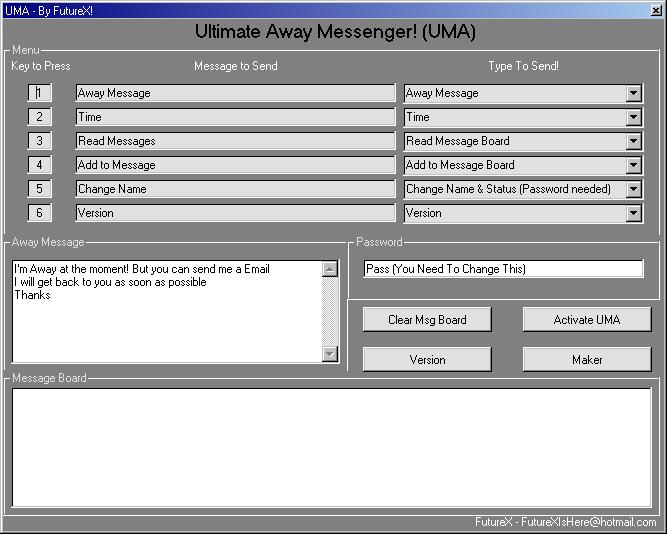



## UMA \(Ultimate Messenger Away\) 4 MSN

### Description

My code is a UMA, Ulimate Messenger Away for MSN Messenger. When your away you open this program and let it take messages. It have a interactive menu sytem
 
### More Info
 
User Inputs

a great tool

u can see the messages in a IM

             |
---                |---
**Submitted On**   |2002-01-11 19:06:40
**By**             |[FutureX ](https://github.com/Planet-Source-Code/PSCIndex/blob/master/ByAuthor/futurex.md)
**Level**          |Intermediate
**User Rating**    |5.0 (15 globes from 3 users)
**Compatibility**  |VB 6\.0
**Category**       |[Miscellaneous](https://github.com/Planet-Source-Code/PSCIndex/blob/master/ByCategory/miscellaneous__1-1.md)
**World**          |[Visual Basic](https://github.com/Planet-Source-Code/PSCIndex/blob/master/ByWorld/visual-basic.md)
**Archive File**   |[UMA\_\(Ultim480081112002\.zip](https://github.com/Planet-Source-Code/futurex-uma-ultimate-messenger-away-4-msn__1-30698/archive/master.zip)

